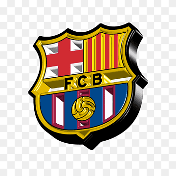

# learning-readme

       

# Barça o Melhor
<!-- ## Titulo
### Titulo
#### Titulo
##### Titulo -->

<h1>Barça o Melhor</h1>
<!-- <h2>Titulo</h2>
<h3>Titulo</h3>
<h4>Titulo</h4>
<h5>Titulo</h5> -->

Este é um parágrafo do meu readme.

Indice
<ul> 
   <li><a href="#">Bem vindo</a></li>
</ul>

#### :rocket: status
... em construção